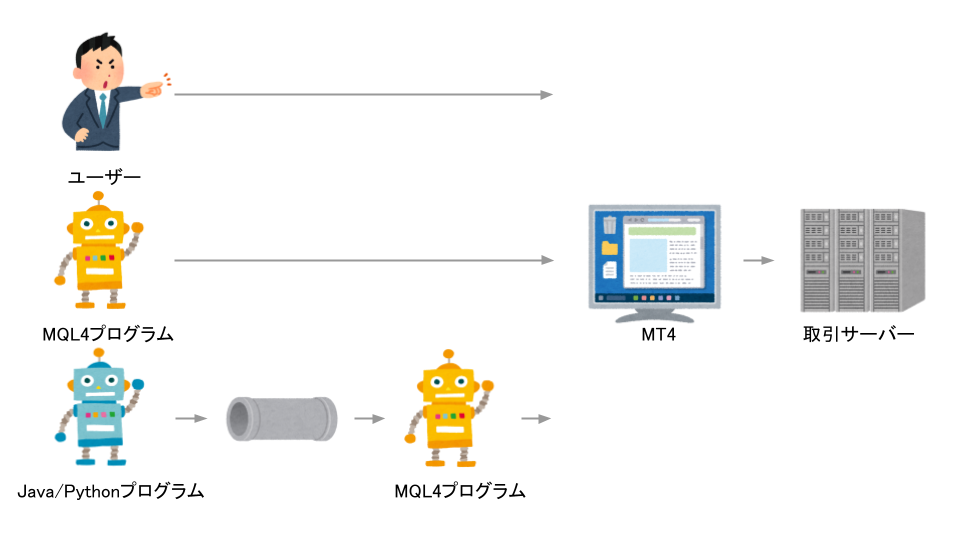
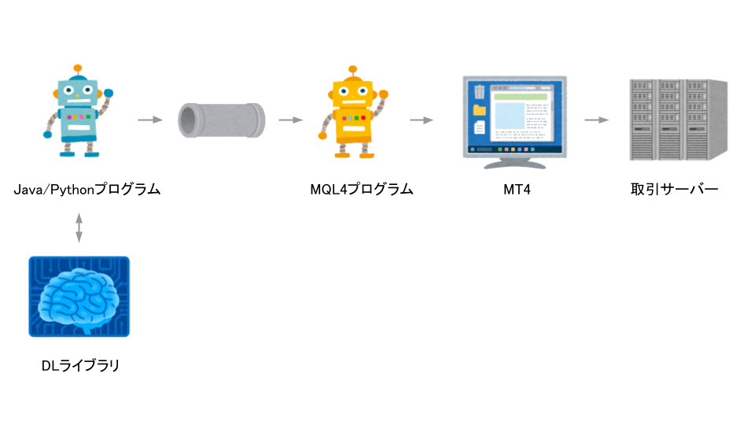
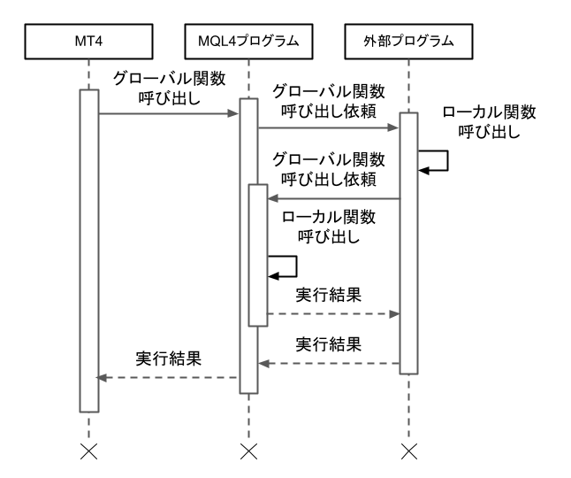

# MT4-Connector-Server
## 概要
MT4を外部のプログラムからコントロールするための制御基盤です。  
ここで公開しているのはサーバー側の機能です。

クライアントは以下のURLで公開しています：  
- Java版 クライアント  
https://github.com/Kurokawa-kun/MT4-Connector-Client-Java  
- Python版 クライアント  
https://github.com/Kurokawa-kun/MT4-Connector-Client-Python  
  
下図のような仕組みで動作します。    

    
MT4からは単体のMQL4プログラム（EA）が動作しているように見えます。MQL4プログラムはWindows APIを呼び出して名前付きパイプを作成します。この名前付きパイプを通してMQL4プログラム（以下、サーバーとも呼ぶ）とJava/Pythonプログラム（以下、外部プログラムまたはクライアントと呼ぶ）が通信を行います。クライアントはConnectorクラスを継承しており、MQL4の関数と同名の関数を呼び出すことができます。これによりクライアント側でMQL4の関数を透過的に扱うことができます。それだけではなく、クライアントの言語がもつライブラリ（例えばベクトル型への格納、DBMSへのアクセス、GUI画面の表示等）を利用することも可能です。    
    
## 将来的にやりたいこと
MT4/MT5を外部から操作することではなく、ディープラーニングで相場情報を学習して自動注文を行うことです。このプログラムはその基盤となるものです。  

    
## 必要なもの
必要に応じて以下のソフトウェアを用意してください。
- MT4（Build 1367以降）
- Javaの開発環境（JDK17以降）、または
- Pythonの開発環境（Python 3.10以降）

## 使用方法
### クライアント側の準備

1. クライアント側のReleasesからzipをダウンロードします。
1. zipファイルの中身を開発用の作業フォルダに展開します。
1. 開発環境で開きます。Connectorクラスを継承してOnInit, OnTick, OnDeinit関数を実装します。

### サーバー側の準備
1. サーバー側のReleasesからzipをダウンロードします。  
1. zipファイルの中身をMT4のデータフォルダに展開します。  
    ※ デフォルトのデータフォルダは以下：  
    C:\Users\（ユーザー名）\AppData\Roaming\MetaQuotes\Terminal\（インスタンスID）
1. MT4を起動します。  
1. NavigatorウィンドウのExpertsツリーからConnectorをチャートに貼り付けます。  
    ※ 「DLLの使用を許可する」にチェックを入れてください
1. 必要なパラメータを指定します。  

## 制限事項
- 以下の機能群はJava/Pythonに代替機能があることや、本来の目的とは無関係のためサポートしません。
  - 算術関数
  - 文字列関数
  - 配列関数
  - オブジェクト関数
  - ファイル関数
  - トレードシグナル
  - GUIオブジェクト
  - OnTick, OnTimer, Ondeinit以外のイベント
- Java版クライアントと比較してPython版クライアントには以下の点で機能制限があります。
  - シンボルの全ティックデータをTickDataリストにロードする機能がありません。これは「既知の問題」にある通りロードに時間がかかりすぎて実用的でないためです。次版でアルゴリズムを改良してから実装します。
  - Pythonではint型とlong型、およびfloat型とdouble型の区別がないため、整数はすべてint型、実数はfloat型として扱われます。
  - Pythonには関数のオーバーロードがないため同一名をとるMQL4の関数には最も引数の多い関数のみ対応しています。

## 既知の問題
- シンボルの数にもよりますが、全シンボル全時間足のデータを取得しようとすると1時間以上かかります。これは名前付きパイプのバッファのデータ領域が256バイトしかなく、データの送受信に時間がかかるためです。将来的には32768バイト程度に拡張して高速化する予定です。
- MQL4の仕様により文字列型の最大長は255文字です。しかし、クライアントがサーバに送信できるマルチバイト文字列の最大長は、ANSIの場合127文字、UTF-8の場合85文字となります（次版で修正します）。

## 補足
- MT5のサポートは？
    - 手が空いたらそのうち取り組むかもしれません。    

# 技術的な説明
## しくみ
上で述べた通り、サーバーが起動するとWindows APIを呼び出して名前付きパイプを作成しクライアントからの接続を待ちます。通信はすべて同期的に行われます。受信側のプロセスはデータを受け取るまでブロック状態になります。    

## メッセージ
以下の通り、サーバーとクライアントの間で512バイトのメッセージのやり取りが行われます。送受信する最小単位256バイトをデータグラムと呼んでいます（1メッセージ=2データグラム）。

<table width="800">
  <tr><td colspan="4" width="400" align="center">管理領域 (256バイト)</td><td colspan="4" width="400" align="center">データ領域 (256バイト)</td></tr>
  <tr>
    <td width="12.5%" align="center">1バイト</td>
    <td width="12.5%" align="center">1バイト</td>
    <td width="12.5%" align="center">…</td>
    <td width="12.5%" align="center"></td>
    <td width="12.5%" align="center">1バイト</td>
    <td width="12.5%" align="center">…</td>
    <td width="12.5%" align="center"></td>
    <td width="12.5%" align="center">1バイト</td>
  </tr>
  <tr>
    <td width="12.5%" align="center">メッセージID</td>
    <td width="12.5%" align="center">緊急停止フラグ</td>
    <td width="12.5%" align="center"></td>
    <td width="12.5%" align="center"></td>
    <td width="12.5%" align="center">データ本体</td>
    <td width="12.5%" align="center">…</td>
    <td width="12.5%" align="center"></td>
    <td width="12.5%" align="center">0x1A…NULLを表す</td>
  </tr>
</table>
※ 次版で改良します。1つのメッセージに多くのデータグラムを載せられるように改良します。

## 関数呼び出し
サーバーとクライアントの間でメッセージを介して関数呼び出しを行います。ここではMQL4の関数と外部プログラムの関数を2つに分類しています。
- グローバル関数 … 外部から呼び出される関数
- ローカル関数 … グローバル関数の内部で呼び出される関数（ローカル関数は外部から呼び出し依頼をすることができません）  

<table>
  <tr><td colspan="2" width="50%" align="center">サーバー</td><td colspan="2" width="50%" align="center">クライアント</td></tr>
  <tr><td width="15%" align="center">グローバル関数</td><td width="35%" align="center">役割</td><td width="15%" align="center">グローバル関数</td><td width="35%" align="center">役割</td></tr>
  <tr><td>OnInit</td><td>クライアントにOnInitの呼び出し依頼を行います</td><td>OnInit</td><td>MT4のOnInitに相当する処理を行い結果を返却します。</td></tr>
  <tr><td>OnTick</td><td>クライアントにOnTickの呼び出し依頼を行います</td><td>OnTick</td><td>MT4のOnTickに相当する処理を行い結果を返却します。</td></tr>
  <tr><td>OnDeinit</td><td>クライアントにOnDeinitの呼び出し依頼を行います</td><td>OnDeinit</td><td>MT4のOnDeinitに相当する処理を行い結果を返却します。</td></tr>
  <tr><td>上記以外のMQL4関数（例えばOrderSend）</td><td>MQL4の同名の関数を呼び出して結果を返却します。</td><td></td><td></td></tr>
</table>
    
MT4でイベントが発生するたびに以下の機序で関数が呼び出されます。  

## メッセージ種別
通信で用いられるメッセージ種別は以下の通りです。サーバーとクライアントでソースコードを共通化したかったためMSG_NOPメッセージを導入しています。起動してから最初にMSG_REQUEST_CALL_FUNCTIONを送信するのがサーバー、MSG_NOPの送信を試みることで何もしない（＝後続の受信処理が先に呼ばれる）のがクライアントとなります。

<table>
  <tr>
  <th width="5%" align="center">メッセージID</th>
  <th width="15%" align="center">意味</th>
  <th width="10%" align="center">関数呼び出し依頼元が送信する</th>
  <th width="10%" align="center">関数呼び出し依頼先が送信する</th>
  <th width="60%" align="center">備考</th>
  </tr>
  <tr>
  <td align="center">MSG_NULL</td>
  <td align="center">未指定</td>
  <td align="center">○</td>
  <td align="center">○</td>
  <td align="left">異常検出用。このメッセージが送信されるということは送信元が正しく機能していない。サーバー/クライアントとも、このメッセージを受信した場合は異常が起きたものとして緊急停止する。</td>
  </tr>
  <tr>
  <td align="center">MSG_NOP</td>
  <td align="center">何もしない</td>
  <td align="center">‐</td>
  <td align="center">‐</td>
  <td align="left">このメッセージIDが指定されていた場合、SendMessage関数の中でメッセージの送信がスキップされる。</td>
  </tr>
  <tr>
  <td align="center">MSG_REQUEST_CALL_FUNCTION</td>
  <td align="center">関数呼び出し依頼</td>
  <td align="center">○</td>
  <td align="center"></td>
  <td align="left">データ領域に関数名が記載されている。このメッセージを受信した依頼先は依頼元にMSG_PARAMETERを送信する。</td>
  </tr>
  <tr>
  <td align="center">MSG_REQUEST_PARAMETER</td>
  <td align="center">パラメタ送信要求</td>
  <td align="center"></td>
  <td align="center">○</td>
  <td align="left"></td>
  </tr>
  <tr>
  <td align="center">MSG_PARAMETER</td>
  <td align="center">パラメタ送信</td>
  <td align="center">○</td>
  <td align="center"></td>
  <td align="left">パラメタが複数ある場合は複数送信可。</td>
  </tr>
  <tr>
  <td align="center">MSG_PARAMETER_END</td>
  <td align="center">パラメタ送信終了</td>
  <td align="center">○</td>
  <td align="center"></td>
  <td align="left">パラメタの送信が終了したことを表す。このメッセージが送信されると依頼先は指定された関数を実行する。関数実行後は復帰値をMSG_RETURN_VALUEメッセージに含めて送信する。</td>
  </tr>
  <tr>
  <td align="center">MSG_RETURN_VALUE</td>
  <td align="center">復帰値の送信要求</td>
  <td align="center"></td>
  <td align="center">○</td>
  <td align="left">依頼先からMSG_RETURN_VALUEが返却されると依頼元はMSG_REQUEST_ERROR_CODEを送信する。</td>
  </tr>
  <tr>
  <td align="center">MSG_REQUEST_ERROR_CODE</td>
  <td align="center">エラーコードの送信要求</td>
  <td align="center">○</td>
  <td align="center"></td>
  <td align="left"></td>
  </tr>
  <tr>
  <td align="center">MSG_ERROR_CODE</td>
  <td align="center">エラーコードの送信</td>
  <td align="center"></td>
  <td align="center">○</td>
  <td align="left">依頼先からMSG_ERROR_CODEが返却されると依頼元はMSG_REQUEST_AUXILIARYを送信する。</td>
  </tr>
  <tr>
  <td align="center">MSG_REQUEST_AUXILIARY</td>
  <td align="center">補助情報の送信要求</td>
  <td align="center">○</td>
  <td align="center"></td>
  <td align="left"></td>
  </tr>
  <tr>
  <td align="center">MSG_AUXILIARY</td>
  <td align="center">補助情報の送信</td>
  <td align="center"></td>
  <td align="center">○</td>
  <td align="left">補助情報が複数ある場合は複数送信可。</td>
  </tr>
  <tr>
  <td align="center">MSG_AUXILIARY_END</td>
  <td align="center">補助情報の送信終了</td>
  <td align="center"></td>
  <td align="center">○</td>
  <td align="left"></td>
  </tr>
</table>
※ 次版で改良します。関数の呼び出し依頼と実行結果がすべて1つのメッセージに載るように改良します。  
 
※ 1つの復帰値に収まらない値（例えば配列や参照渡しされたパラメタの値を変更した場合）を呼び出し元に返却する場合に補助情報として送信しています（次版で廃止して1つのメッセージに載るようにします）。    
